# sonar qube

## sonarqube와 jenkins 연동 실습

1. 실습 예제 fork 하기


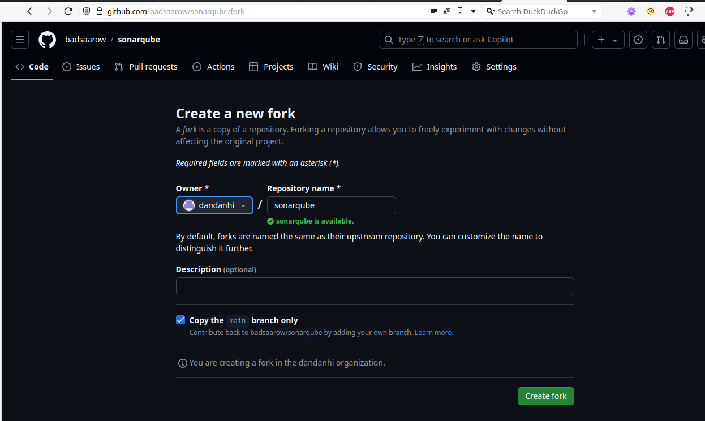

2. sonarqube에 자신의 프로젝트 만들기

https://sonarqube.momoiot.co.kr/projects

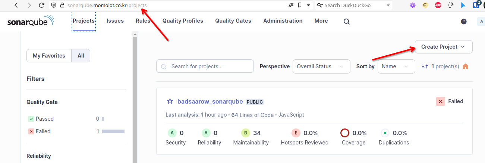

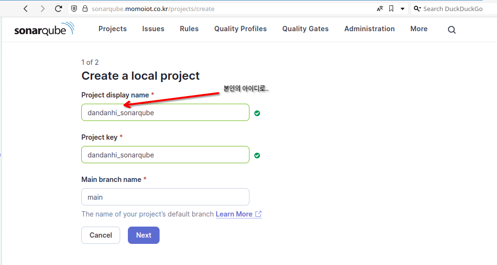
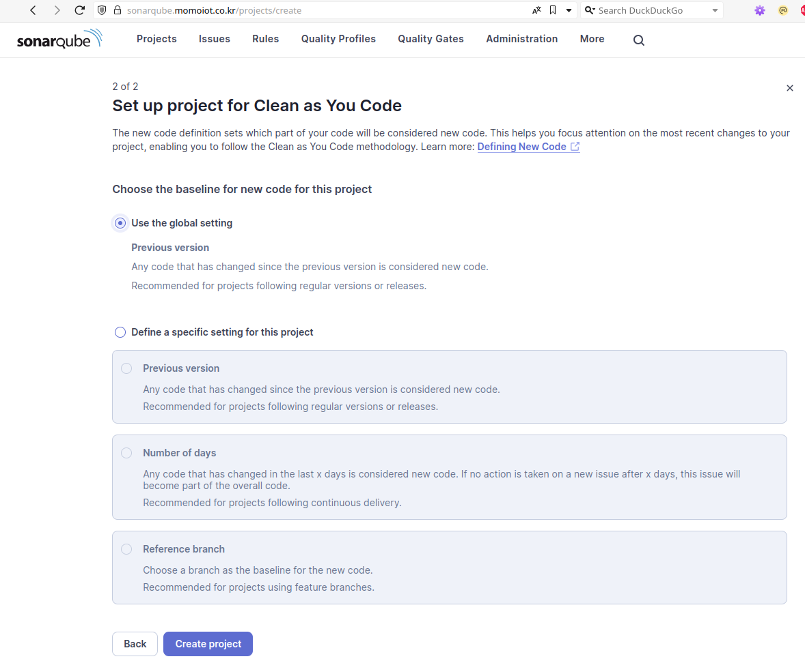
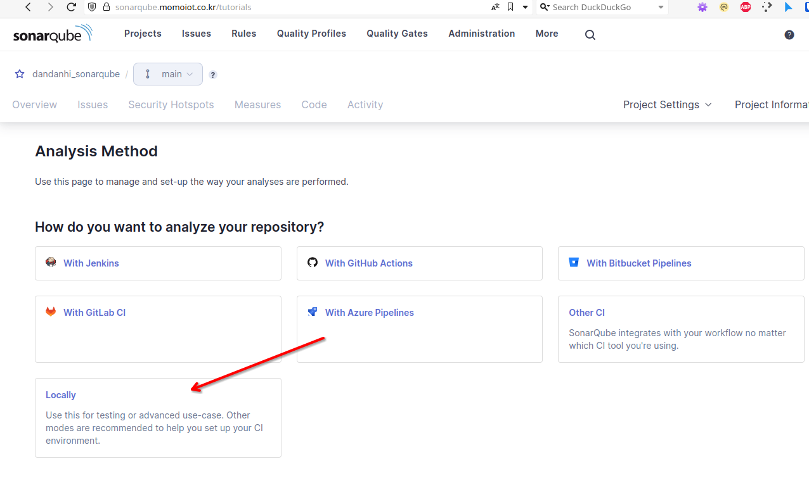
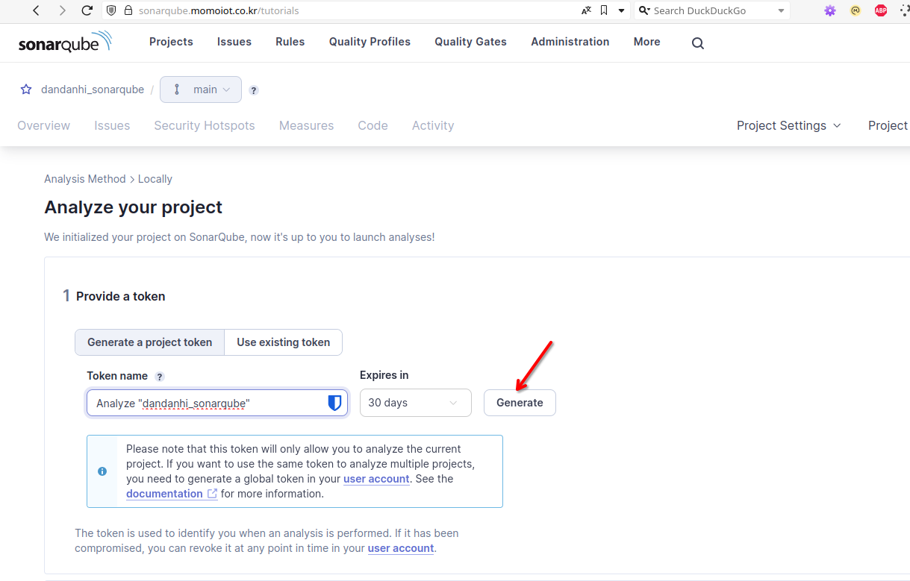


3. Jenkins에 파이프라인 만들기

https://jenkins.momoiot.co.kr/me/my-views/view/all/

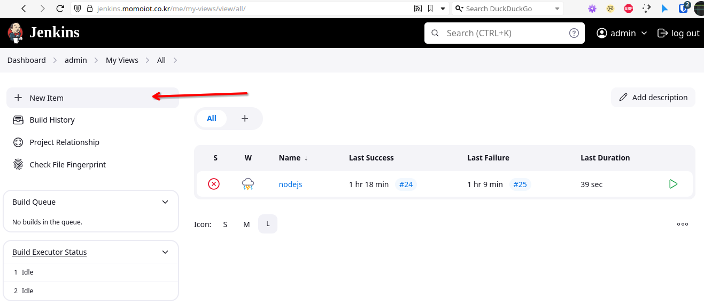
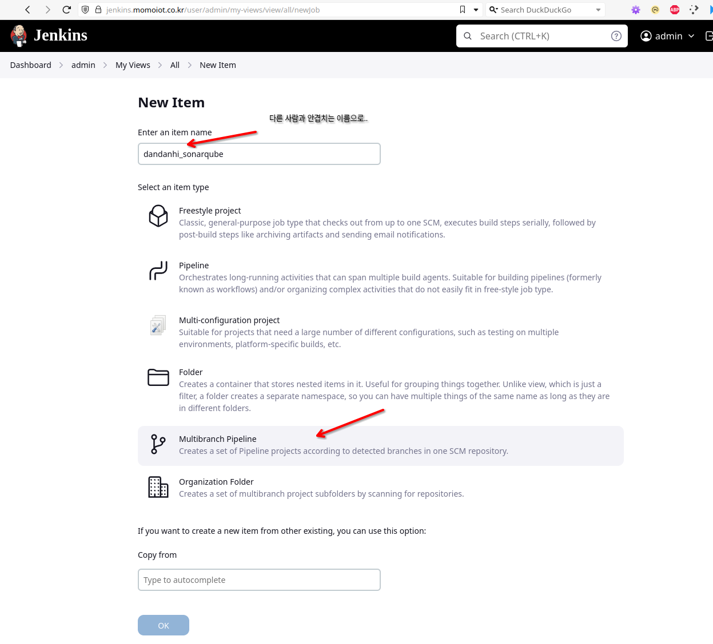
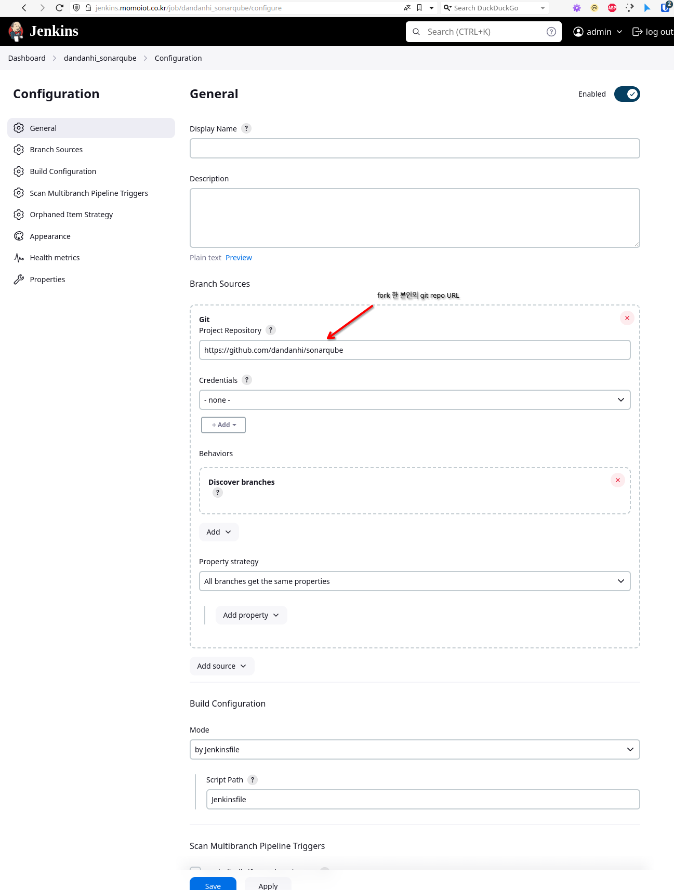


4. Jenkinsfile의 sonarq 프로젝트 키 변경

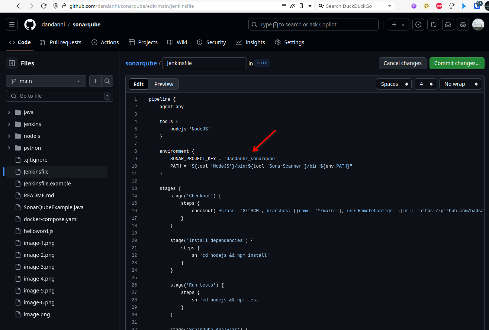


5. Jenkins 파이프라인 수동 실행


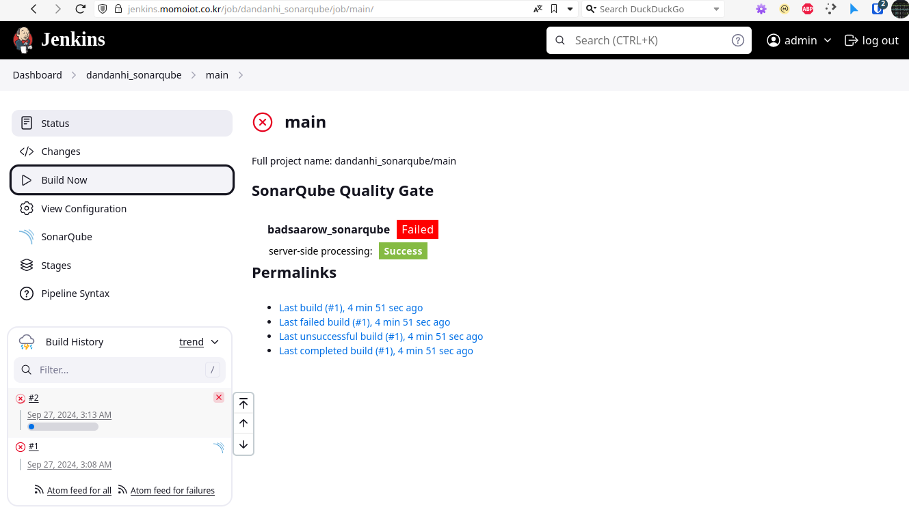
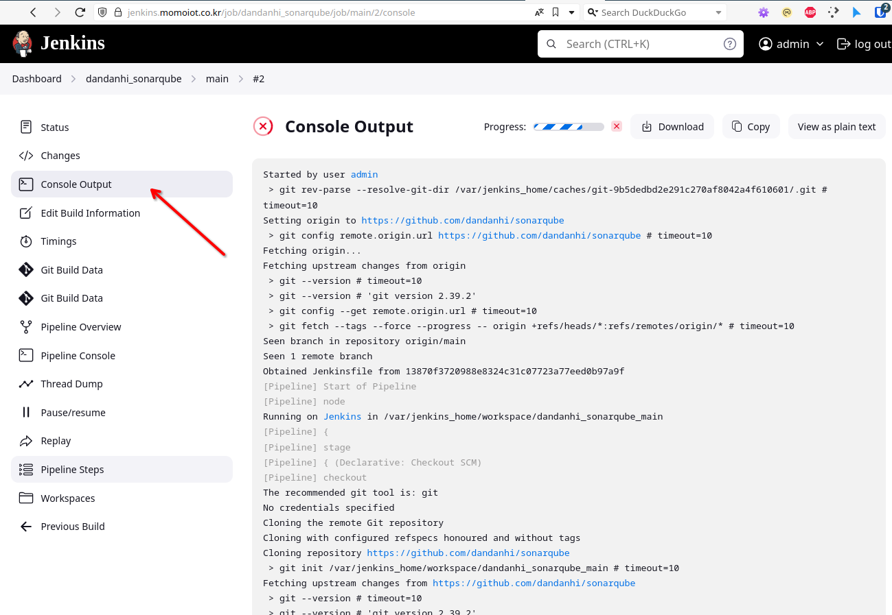
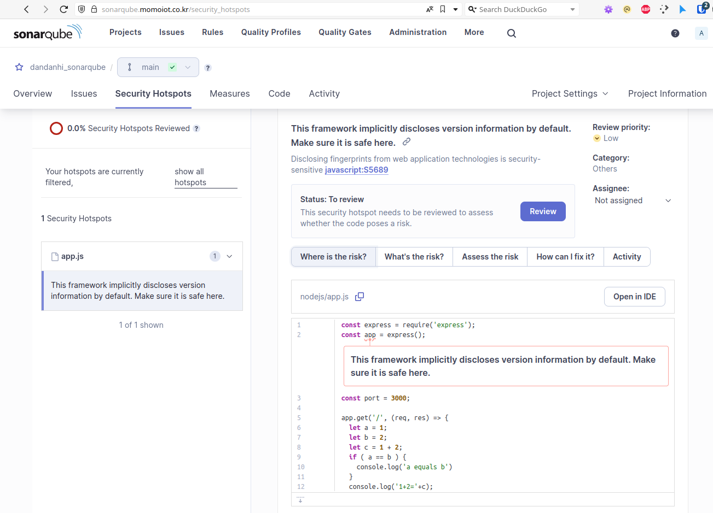

## sonar scanner

windows

```
docker run --rm -e SONAR_HOST_URL="http://host.docker.internal:9000"  -v ".:/usr/src" sonarsource/sonar-scanner-cli -D"sonar.projectKey=hello2" -D"sonar.sources=." -D"sonar.host.url=http://host.docker.internal:9000" -D"sonar.token=CHANGEIT"
```

mac

```
docker run --rm \
  -e SONAR_HOST_URL="http://host.docker.internal:9000"  \
  -v ".:/usr/src" sonarsource/sonar-scanner-cli \
  -Dsonar.projectKey=java \
  -Dsonar.sources=. \
  -D"sonar.java.binaries=target/classes" \
  -Dsonar.host.url=http://http://host.docker.internal:9000 \
  -Dsonar.token=sqp_a1ef2470a50a6570ad47ad410ea46135416c8f22
```

## custom rules


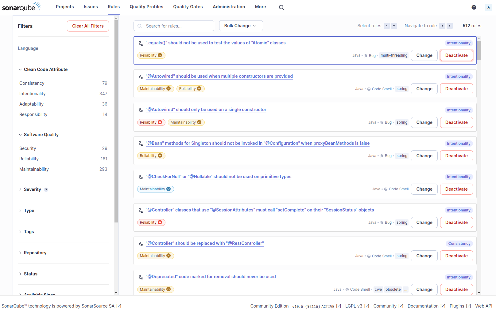


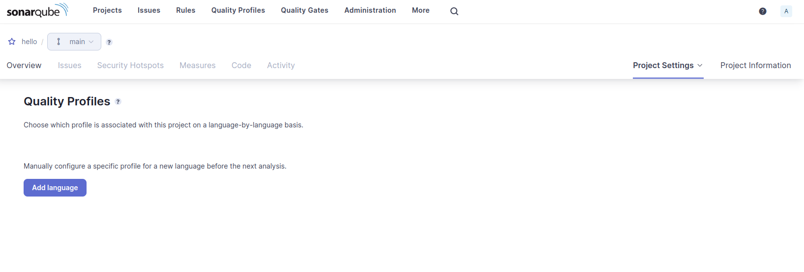
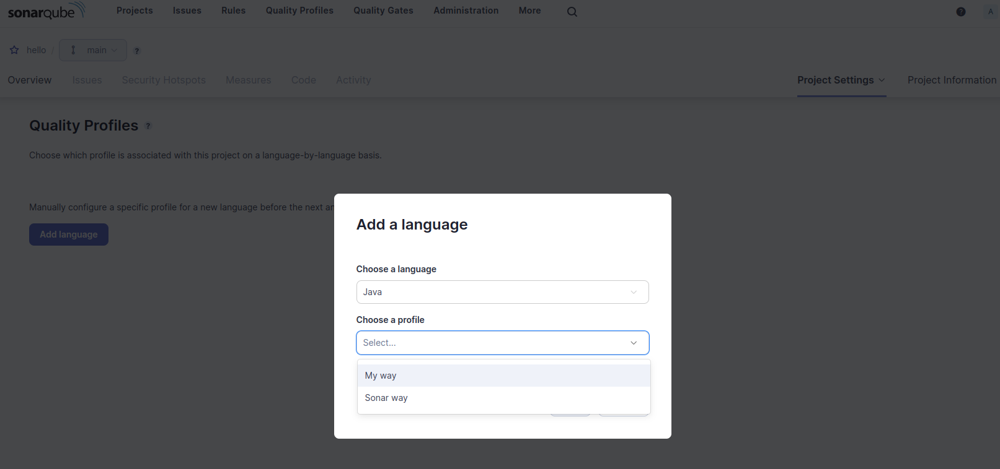
